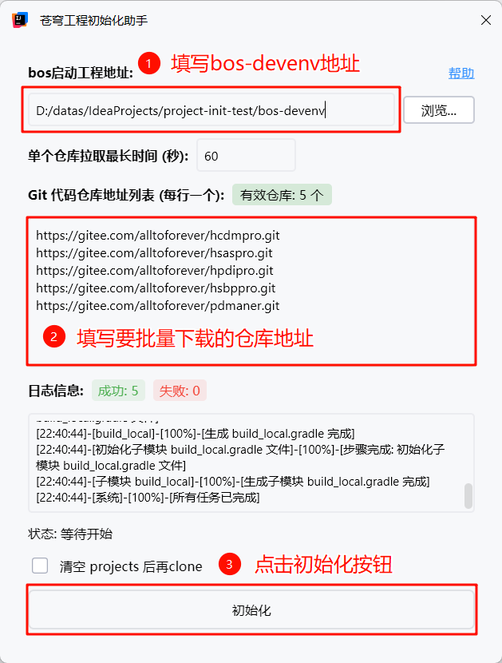

# 苍穹工程初始化助手 (BOS Project Initialization Assistant)

[English Version](README_en.md)

这是一个为金蝶苍穹平台开发者设计的 IntelliJ IDEA(最低版本2025.2.4) 插件，旨在简化苍穹项目的初始化流程。通过图形化界面配置，可以一键批量拉取多个 Git 仓库，并自动完成苍穹项目所需的各项配置工作。



## 功能特性

- 🚀 **批量 Git 克隆**：支持一次性拉取多个 Git 仓库
- ⚙️ **自动化配置**：自动生成或修改苍穹平台所需的配置文件
- 📊 **可视化界面**：直观的图形化操作界面，实时显示进度和日志
- ⏱️ **超时控制**：可设置单个仓库拉取的最长等待时间
- 🧹 **清理选项**：支持在初始化前清空现有项目目录
- 🛑 **可中断操作**：支持随时取消正在进行的任务

## 使用方法

1. 在 IntelliJ IDEA 中打开插件
2. 通过菜单 `工具 -> 苍穹工程初始化助手` 启动插件
3. 配置以下参数：
   - 选择苍穹启动工程的根目录
   - 输入需要拉取的 Git 仓库地址列表（每行一个）
   - 设置超时时间（可选，默认60秒）
   - 选择是否清空已有项目（可选）
4. 点击「初始化」按钮开始执行

## 项目结构

```
.
├── src/main/kotlin/com/songwh/bosprojectinit/
│   ├── actions/                 # IDEA 动作入口
│   │   └── ProjectInitAction.kt # 插件主入口动作
│   ├── logic/                   # 核心业务逻辑
│   │   ├── steps/               # 初始化步骤定义
│   │   │   ├── impl/            # 具体步骤实现
│   │   │   │   ├── CloneStep.kt           # 克隆仓库步骤
│   │   │   │   ├── ConfigGradleStep.kt    # 同步 config.gradle 步骤
│   │   │   │   ├── SettingsStep.kt        # 配置 settings.gradle 步骤
│   │   │   │   ├── BuildLocalStep.kt      # 生成根目录 build_local.gradle 步骤
│   │   │   │   └── ModuleBuildLocalStep.kt # 生成模块 build_local.gradle 步骤
│   │   │   └── IProjectInitStep.kt        # 步骤接口定义
│   │   └── ProjectInitializer.kt          # 项目初始化器核心类
│   ├── model/                             # 数据模型
│   │   └── InitializationModels.kt        # 各种数据模型定义
│   ├── ui/                                # 用户界面
│   │   ├── components/                    # UI 组件
│   │   ├── ProjectInitDialog.kt           # 初始化对话框容器
│   │   ├── ProjectInitView.kt             # 初始化主视图
│   │   └── Typography.kt                  # 字体样式定义
│   ├── utils/                             # 工具类
│   │   └── GitUtils.kt                    # Git 操作工具类
│   ├── BosProjectInitTool.kt              # 工具窗口实现
│   └── MessageBundle.kt                   # 国际化消息束
│
├── src/main/resources/
│   ├── messages/                          # 多语言资源文件
│   │   ├── MessageBundle.properties       # 默认语言包（中文）
│   │   ├── MessageBundle_en_US.properties # 英文语言包
│   │   └── MessageBundle_zh_CN.properties # 中文语言包
│   ├── image/                             # 图片资源
│   │   └── help.png                       # 帮助图片
│   └── META-INF/
│       └── plugin.xml                     # 插件配置文件
│
├── build.gradle.kts                       # Gradle 构建脚本
├── settings.gradle.kts                    # Gradle 设置文件
└── gradle.properties                      # Gradle 属性配置
```

## 核心工作流程

1. **代码克隆**：根据用户提供的 Git 地址列表，批量克隆到指定的 projects 目录
2. **配置同步**：同步 config.gradle 配置文件
3. **设置配置**：生成或更新 settings.gradle 文件以包含所有模块
4. **构建配置**：为根项目生成 build_local.gradle 文件
5. **模块配置**：为每个子模块生成相应的 build_local.gradle 文件

## 开发环境

- IntelliJ IDEA 2025.2.4 或更高版本
- JDK 21
- Kotlin 2.1.20
- Gradle 8.x

## 构建和运行

```bash
# 构建插件
./gradlew buildPlugin

# 运行插件进行测试
./gradlew runIde
```

## 技术栈

- Kotlin
- Compose UI for IntelliJ
- Coroutines
- Git 命令行工具

## 注意事项

- 确保系统已安装 Git 命令行工具并已添加到 PATH 环境变量中
- 插件需要访问网络以克隆远程仓库
- 插件需要对目标目录具有读写权限